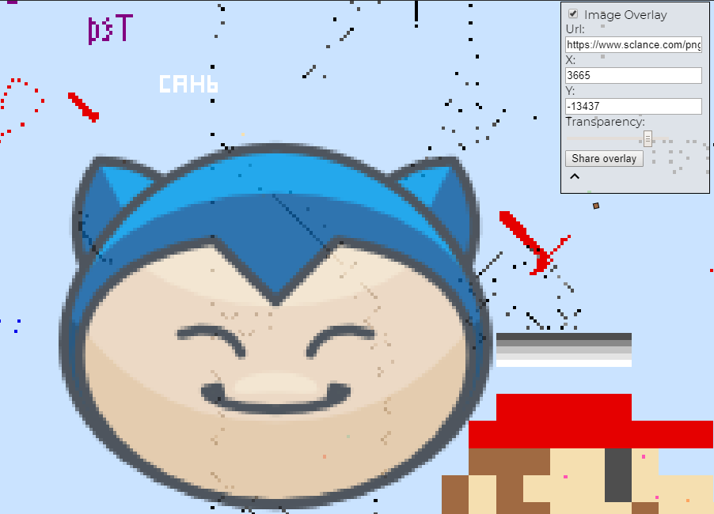
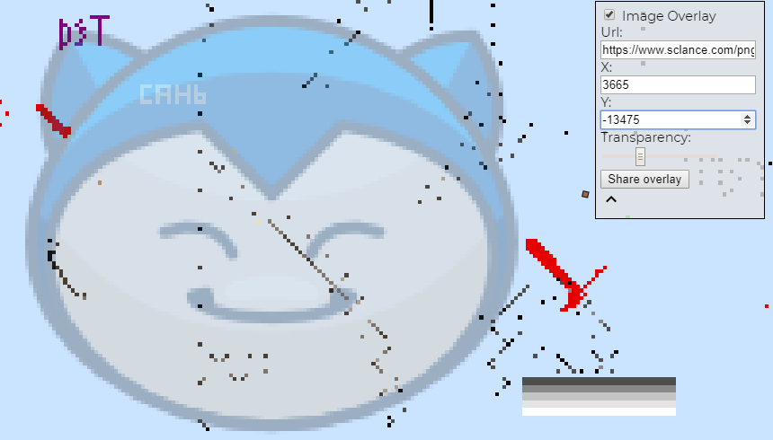
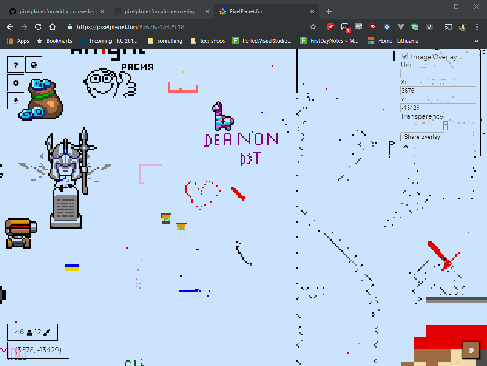

# Overlay Picture for canvaspixel.net

## How to setup

1. Install tampermonkey addon for your browser from - <https://www.tampermonkey.net/> .
2. Open <https://bypikod.github.io/canvaspixel.net-OverlayPicture/pixelPlanetOverlay-loader.user.js> .
3. Click "Install".
4. Enjoy.

## Preview

